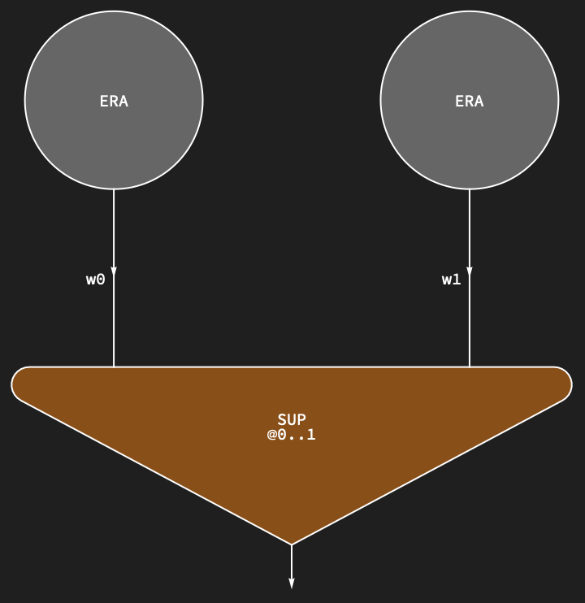
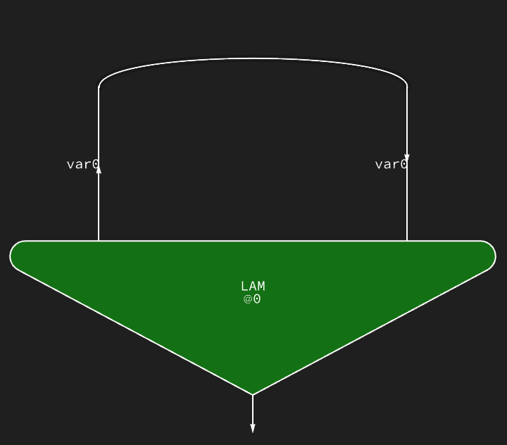
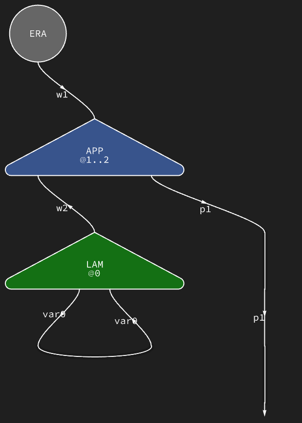
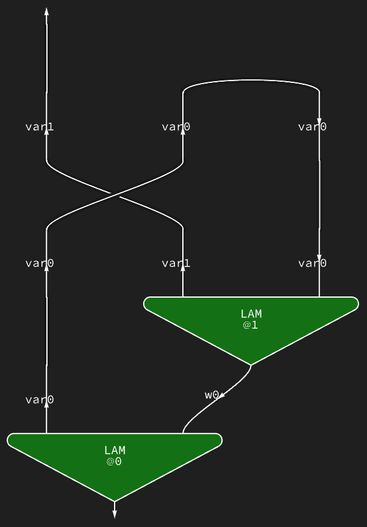
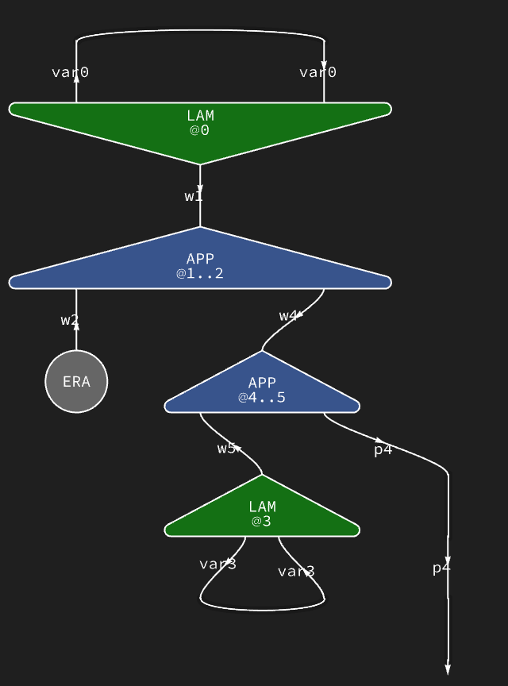
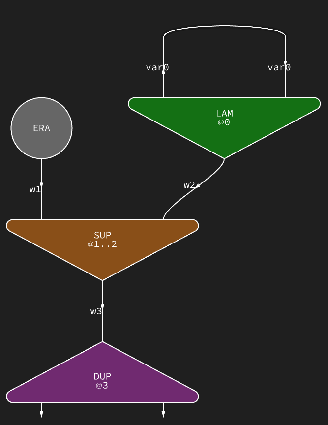
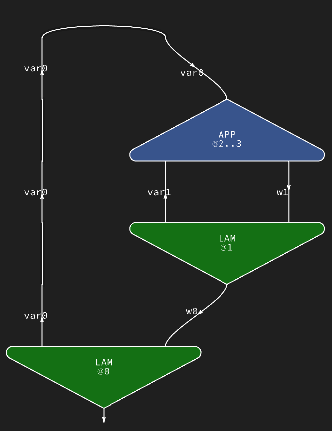
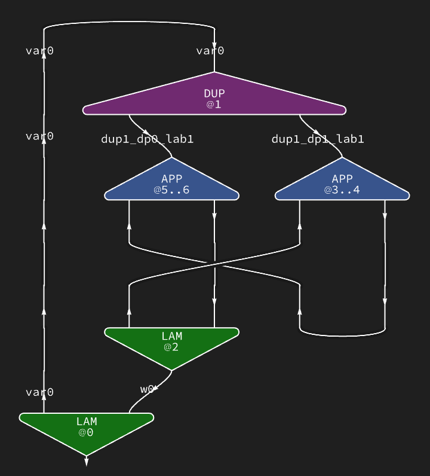
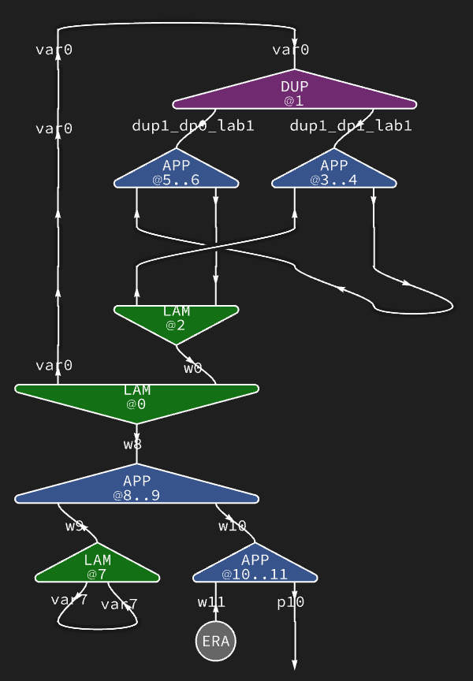

# THeapDiagram: IC-style string diagrams

`THeapDiagram[term]` turns the current heap into a
[Wolfram`DiagrammaticComputation`][dc] `DiagramNetwork` that renders as an
interaction-net string diagram. It is the second visualization
of the heap alongside [`THeapGraph`](heap_graph.md).

Implementation lives in [`wl/THVMLink/Kernel/Diagram.wl`](../wl/THVMLink/Kernel/Diagram.wl)
(subcontext `THVMLink`Diagram``). The examples runner
[`wl/Examples/run.wls`](../wl/Examples/run.wls) exports
`diagram["Arrange"]["Grid"]` to `diagram.png` alongside each
example's `term.png`.

[dc]: https://resources.wolframcloud.com/PacletRepository/resources/Wolfram/DiagrammaticComputation/

## Goals and constraints

- **Top-to-bottom data flow.** The runner uses
  `diagram["Arrange"]["Grid"]`, which lays diagrams out as a
  circuit with inputs on top and outputs on bottom. Every wire
  should flow naturally in that direction; no arrow should flip
  or double back unnecessarily.
- **No identity (binary) spiders on wires.** A wire connecting
  two ports should render as a single arrow, not a wire plus a
  spider vertex plus another wire. DC's `DiagramsNetGraph` only
  avoids inserting a binary spider when the two ports on a wire
  have *different* DualQ values (one plain, one `PortDual`).
- **No triple wires.** Distinct ports must use distinct wire
  names; two different ports of an agent must never end up on the
  same wire just because their heap locations coincide.
- **One diagram per agent.** Each LAM/APP/SUP/DUP/ERA in the heap
  becomes one `Diagram[...]` primitive; `DiagramNetwork` connects
  them by wire name.

## Examples, in order of complexity

The examples below come from [`wl/Examples/`](../../wl/Examples/)
and are rendered by `make wl-examples`. Each PNG shows the heap
AS CONSTRUCTED, pre-reduction.

### 1. `sup-of-eras` — `SUP(ERA, ERA)`

A SUP combining two erasers. No LAM, no cycles, no DUP. Purely
producer → consumer flow.



Two ERA disks feed SUP's L and R input slots. SUP's result
dangles at the bottom (root, no carrier, so a synthetic `p0`
wire).

### 2. `identity` — `λx. x`

A single LAM whose body is a VAR back to its own binder.



LAM@0 is the root (no principal carrier). Its body slot reads
VAR(0), which is the LAM's own binder, so body and binder share
the wire `var0`. That shared wire is the identity self-loop,
routed around the LAM by `Arrange["Grid"]`. The dangling `p0`
wire would be the LAM's principal if it were consumed.

### 3. `era-app` — `APP(ERA, λx. x)`

The identity applied to an eraser.



ERA sits above APP on the left, connected via `w1` into APP's f
slot. LAM@0 is the identity from the previous example, sitting
above APP on the right: its two aux ports at the top form the
`var0` self-loop (body = VAR(binder)), and its principal `w2`
at the bottom drops into APP's x slot. APP's result `p1`
dangles at the bottom.

### 4. `k-combinator` — `λx. λy. x`

Two nested LAMs; only `x` is used, `y` is discarded.



LAM@0 (bottom, the root, binds `x`) has its body slot filled
with LAM@1 (top, binds `y`). The `w0` wire carries LAM@1's
principal down into LAM@0's body aux. The `var0` wire is LAM@0's
binder and reappears inside LAM@1 as its body aux (since LAM@1's
body is `x` = VAR(0)). LAM@1's own binder `var1` dangles unused
(`y` never appears in the body).

### 5. `nested-apps` — `APP(λx.x, APP(λy.y, ERA))`

Two stacked applications with identities.



Two identity LAMs, each with its own `var<base>` self-loop at
the top. Each sits in an APP's arg slot, principal dropping
into that slot. The outer APP's f slot holds the inner APP.

### 6. `dup-sup-annihilate` — `λx. SUP(DP0(x), DP1(x)) applied to ERA`

Uses the DUP/SUP interaction.



The purple DUP at the bottom carries two aux outputs
`dup3_dp0_lab0` and `dup3_dp1_lab0`; they feed the orange SUP's L
and R inputs. ERA sits on the left. The green LAM's identity
self-loop routes `var0`; its principal flows down through the
SUP/DUP chain.

### 7. `church-1` — `λs. λz. s z`

Church numeral 1. Uses `s` once, so no DUP is needed, but the
variable reference spans two LAM scopes.



### 8. `church-2` — `λs. dup{s0,s1}=s; λz. s0 (s1 z)`

Church numeral 2. Uses `s` twice, so DUP splits it explicitly.



Two stacked LAMs, two APPs chaining `s0 (s1 z)`, and a purple
DUP that takes `s` as its body and splits it into `s0`
(`dup1_dp0_lab1`) and `s1` (`dup1_dp1_lab1`) for each of the two
uses.

### 9. `church-2-applied` — `church-2 f x`

Church 2 applied to two arguments. Largest example.



## Pipeline

1. `discoverAgentsHere[{term}]` walks the heap and the given root
   term, returning an association `<| base -> tag |>` of every
   LAM/APP/SUP/DUP agent. VAR cells collapse to their binder LAM;
   DP0/DP1 cells collapse to their DUP.
2. `discoverErasHere[]` collects every heap cell whose tag is ERA.
3. For each agent, `agentDiagram[base, tag, principalCellOf[base, tag], agents]`
   builds a single `Diagram[label, inputs, outputs, "Shape" -> ..., "Style" -> ...]`.
4. For each ERA cell, `eraDiagram[loc, agents]` builds a
   `Diagram["ERA", ...]`.
5. `DiagramNetwork @@ ds` wires them together by matching wire
   names across ports.

## Wire naming

Wire names are strings derived from heap locations so that two
ports end up on the same wire iff they are meant to connect.

| heap cell at `loc` | `wireFor[loc]`                |
|-----|-----|
| `VAR(v)`           | `"var<v>"`                    |
| `DP0(d, label)`    | `"dup<d>_dp0_lab<label>"`     |
| `DP1(d, label)`    | `"dup<d>_dp1_lab<label>"`     |
| anything else      | `"w<loc>"`                    |

Additional named wires:

- `binderWire[base]` = `"var<base>"` — the output end of a LAM's
  binder port; VAR cells with `val = base` collapse onto this
  wire.
- Synthetic `"p<base>"` — used when an agent has no principal
  carrier cell in the heap (it's the root term). The wire just
  dangles in the diagram.

Splitting the binder wire (`"var<base>"`) from the body-pointer
cell wire (`"w<base>"`) was needed so that K-combinator-shaped
terms don't produce three-port wires.

## Port polarity convention

DC's `Diagram` takes two lists of ports: `inputs` (drawn at top)
and `outputs` (drawn at bottom). Each port can be plain
(`Port[name]`, DualQ = False) or dualed (`SuperStar[name]` =
`PortDual[Port[name]]`, DualQ = True).

For `Arrange["Grid"]` to route every arrow top-to-bottom and for
`DiagramsNetGraph` to skip binary spiders:

- **Every wire must have exactly one dual + one non-dual port.**
- **Inputs are dualed (`SuperStar[name]`); outputs are plain.**

## Per-agent port structure

### LAM — λ

| DC list   | port        | wire                                      | polarity |
|-----|-----|-----|-----|
| input     | binder aux  | `binderWire[base]` = `"var<base>"`        | dualed   |
| input     | body aux    | `wireFor[base]`                           | dualed   |
| *dynamic* | principal   | `wireFor[principalCell]` or `"p<base>"`   | dynamic  |

- LAM has TWO aux ports at the top (both dualed inputs) and one
  principal port (dynamic direction) at the bottom. The aux
  ports are the binder (where VAR uses reference) and the body
  (what `cell[base]` points to).
- For an identity LAM (`λx. x`), `cell[base] = VAR(base)`, so
  both aux wires collapse to `"var<base>"` and the diagram has
  a self-loop between the two aux ports at the top.
- The principal port is where this LAM's term is held in another
  agent's slot (via `principalCellOf`). Its DC position (input
  or output) is picked dynamically.

### APP — application

| DC list   | port   | wire                                      | polarity |
|-----|-----|-----|-----|
| input     | f      | `wireFor[base]`                           | dualed   |
| input     | x      | `wireFor[base + 1]`                       | dualed   |
| *dynamic* | result | `wireFor[principalCell]` or `"p<base>"`   | dynamic  |

- `cell[base]` = f (function), `cell[base+1]` = x (argument).
  Both are inputs APP consumes.
- The result port is where the APP's term is stored in another
  agent's slot. Dynamic direction.

### SUP — superposition

| DC list   | port   | wire                                      | polarity |
|-----|-----|-----|-----|
| input     | L      | `wireFor[base]`                           | dualed   |
| input     | R      | `wireFor[base + 1]`                       | dualed   |
| *dynamic* | result | `wireFor[principalCell]` or `"p<base>"`   | dynamic  |

Same shape as APP: both aux slots are dualed inputs, result is
dynamic.

### DUP — duplicator

| DC list | port   | wire                                     | polarity |
|-----|-----|-----|-----|
| input   | body   | `wireFor[base]`                          | dualed   |
| output  | dp0    | `"dup<base>_dp0_lab<lab>"`              | plain    |
| output  | dp1    | `"dup<base>_dp1_lab<lab>"`              | plain    |

- `cell[base]` holds the value being duplicated — this IS DUP's
  body input, and it doubles as the "principal" connection:
  DUP terms aren't stored as values anywhere, so there is no
  separate carrier cell; DP0/DP1 references carry the outputs.
- `lab` is read from any DP0/DP1 cell pointing back at this DUP.

### ERA — eraser

Single port, dynamic direction.

| DC list   | wire           | polarity |
|-----|-----|-----|
| *dynamic* | `wireFor[loc]` | dynamic  |

## Dynamic port direction

Some ports (LAM principal, APP/SUP result, ERA) have DC positions
determined at render time by looking up the cell they connect to:

```
oppositePortType[loc, agents] = opposite of slotPortType[owner(loc)]
```

where `slotPortType` is:

| slot                     | type    |
|-----|-----|
| `LAM.body`  (offset 0)   | Input   |
| `APP.f`     (offset 0)   | Input   |
| `APP.x`     (offset 1)   | Input   |
| `SUP.L`     (offset 0)   | Input   |
| `SUP.R`     (offset 1)   | Input   |
| `DUP.body`  (offset 0)   | Input   |

Every slot currently has type Input, so in practice every dynamic
port ends up as Output (plain, at the bottom) — but the lookup
keeps the rule explicit.

If a dynamic port's direction comes out as "Input", it is placed
in the diagram's `inputs` list with `SuperStar[name]` (dualed);
if "Output", it goes into `outputs` with plain `name`.

## Shapes and colours

Per-tag shape (DC's `"Shape"` option, a real polygon that DC
auto-orients based on port layout):

| tag | shape                         |
|-----|-----|
| LAM | `"RoundedTriangle"`           |
| DUP | `"RoundedTriangle"`           |
| APP | `"RoundedUpsideDownTriangle"` |
| SUP | `"RoundedUpsideDownTriangle"` |
| ERA | `"Disk"`                      |

Per-tag fill, matching [`THeapGraph`](heap_graph.md)'s palette:

| tag | fill                                   |
|-----|-----|
| LAM | `Darker[StandardGreen,  0.45]`        |
| APP | `Darker[StandardBlue,   0.45]`        |
| SUP | `Darker[StandardOrange, 0.45]`        |
| DUP | `Darker[StandardPurple, 0.45]`        |
| ERA | `GrayLevel[0.4]`                      |

The outline (`EdgeForm`) is white for contrast against the dark
export background (`GrayLevel[0.12]`).

## Label

Column of tag name + base (same shape as the heap graph):

```
TAG
@<base>              (arity-1 agents: LAM, DUP)
TAG
@<base>..<base+1>    (arity-2 agents: APP, SUP)
```

ERA has a single static `"ERA"` label.
