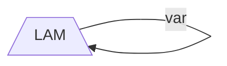
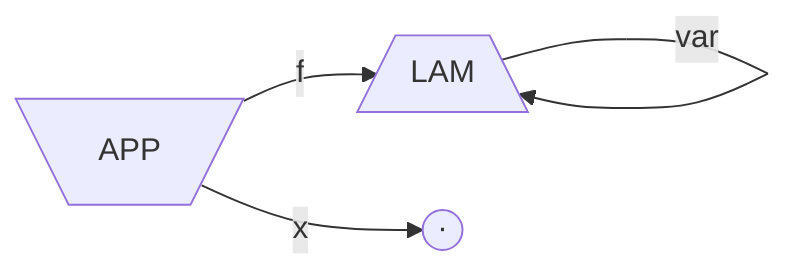
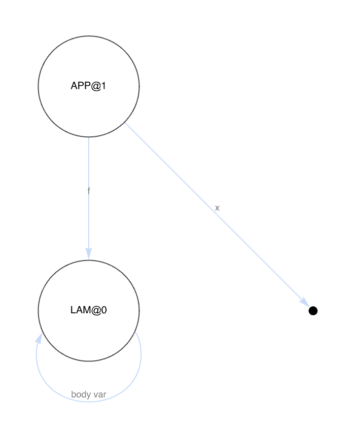
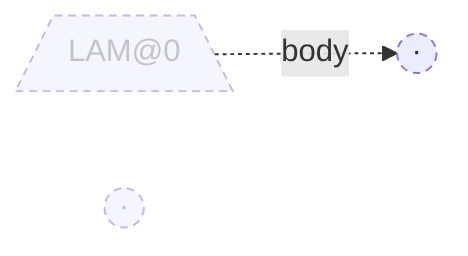
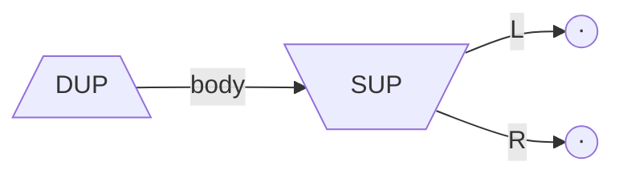
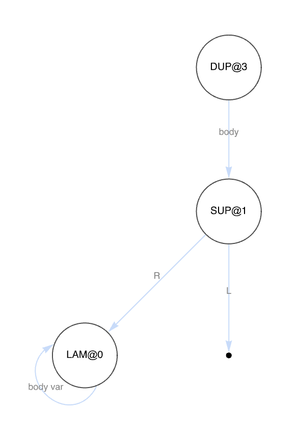
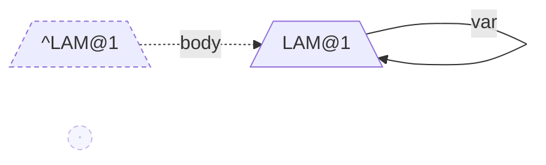
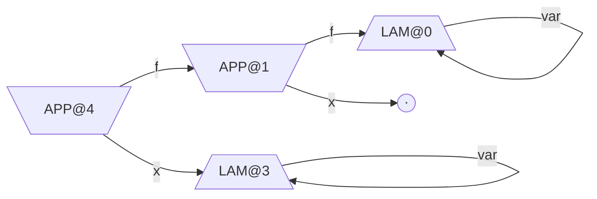

# Heap graph

`THeapGraph[]` renders the runtime's current heap state as an IC
string diagram: each compound term (LAM, APP, SUP, DUP) is an agent
vertex, each `VAR` is absorbed into a wire labelled `var`, and each
`ERA` is a small unlabelled circle marking a consumed port.
`THeap[]` exposes the same graph as its `"Graph"` key.

Display formatting (the summary boxes that render `THeap[...]`,
`TTermInfo[...]`, etc. in a notebook) lives in a separate
[wl/THVMLink/Kernel/Format.wl](../wl/THVMLink/Kernel/Format.wl)
sibling file -- see [wl.md](wl.md#summary-boxes-formatwl).

For the underlying heap layout, see [heap.md](heap.md). For how the
WL paclet exposes the C runtime, see [wl.md](wl.md).

## Graph model

- **Agents are vertices.** Compound term values found in the heap
  (LAM, APP, SUP, DUP) become vertices keyed by their args base
  (the `val` field). Multiple references to the same agent collapse
  to one vertex.
- **VAR is a wire.** A cell containing `VAR(val=B)` is not a vertex.
  It contributes an edge from whichever agent's port owns the cell
  to the LAM at args base `B`, labelled `var`.
- **ERA is a small circle.** A cell containing `ERA` is rendered as a
  tiny unlabelled disk on the incoming edge -- it marks the port as
  consumed by an eraser.
- **Heapless terms are invisible.** A LAM, APP, SUP, DUP, or ERA
  held only as a WL return value (a 64-bit `Term` integer that is
  not stored in any heap cell) does not appear. Either store it via
  `TApp` / `TSup` / etc., or pass it explicitly with
  `THeapGraph[term]` (not yet built; see
  [What's not rendered (today)](#whats-not-rendered-today)).
- **SUB cells are dashed.** A cell whose content has the SUB flag set
  (a substitution holder; see
  [heap.md](heap.md#substitution-model)) is drawn dashed and prefixed
  with `^` in the label.

## Agent shapes and ports

| Agent | Shape (mermaid)            | Ports                                                          |
| ----- | -------------------------- | -------------------------------------------------------------- |
| LAM   | `[/LAM\]` (trapezoid down) | `body` (out, into the body cell), `binder` (collects bound vars) |
| APP   | `[\APP/]` (trapezoid up)   | `f` (in, fun), `x` (in, arg)                                   |
| SUP   | `[\SUP/]` (trapezoid up)   | `L`, `R` (in, two branches)                                    |
| DUP   | `[/DUP\]` (trapezoid down) | `body` (in, the term being duplicated)                         |

`DP0`, `DP1` are not separate agents: they are the two output
projections of a `DUP`. A cell holding `DP0(val=B)` or `DP1(val=B)`
contributes an edge from the owner of that cell into the `out0` /
`out1` port of `DUP@B`.

`@<loc>` is appended to a vertex label only when the diagram has
more than one agent of the same kind. SUP / DUP labels are also
suffixed `[L]` when the dynamic label `L` matters (i.e. you
constructed it with the explicit-label form so you could test
matching against another `SUP` / `DUP`).

## Snapshots

Each example below shows the WL constructor, the resulting heap
state, and the picture `THeapGraph[]` produces. The mermaid renders
on GitHub. Runnable counterparts of every example live under
[wl/Examples/](../wl/Examples/) -- one folder per example, each
holding a minimal `term.wl` and the rendered `graph.png` regenerated
by `make wl-examples` (or
[wl/Examples/run.wls](../wl/Examples/run.wls) directly). A couple of
the examples below embed that live PNG alongside the mermaid so you
can compare; see [wl/Examples/README.md](../wl/Examples/README.md)
for the full catalogue.

### 1. Identity lambda

```wolfram
TLam[var |-> var]
```

| Cell | Term         |
| ---- | ------------ |
| `0`  | `VAR(val=0)` |



The body cell holds `VAR(val=0)` -- a wire from the LAM's body port
back to its own binder, the canonical identity-lambda IC diagram.

### 2. Identity applied to ERA, before reduction

```wolfram
TApp[TLam[var |-> var], TEra[]]
```

| Cell | Term         | Notes              |
| ---- | ------------ | ------------------ |
| `0`  | `VAR(val=0)` | LAM body / binder  |
| `1`  | `LAM(val=0)` | APP `f` port       |
| `2`  | `ERA`        | APP `x` port       |



Live `THeapGraph[app]` (regenerated from
[wl/Examples/02-id-app-era/](../wl/Examples/02-id-app-era/) by
`make wl-examples`):



The APP feeds the LAM into its `f` port and the ERA dot into its `x`
port. The LAM still has its identity self-loop because nothing has
fired yet.

### 3. After `TWnf` of the same APP

```wolfram
app = TApp[TLam[var |-> var], TEra[]]; TWnf[app]
```

APP-LAM fires once. `heap_subst_var(0, ERA)` writes ERA at loc `0`
with SUB set; cells `1` and `2` are untouched and become orphans.

| Cell | Term         | Notes                            |
| ---- | ------------ | -------------------------------- |
| `0`  | `^ERA`       | substitution: SUB=1, value=ERA   |
| `1`  | `LAM(val=0)` | dangling                         |
| `2`  | `ERA`        | dangling                         |



The `LAM@0` survives because cell `1` still holds `LAM(val=0)`. The
LAM's principal port has fired (it lost its argument to APP-LAM), so
the agent is drawn faded with a dashed outgoing edge -- the edge is
still rendered so the LAM's arity (one `body` port) is visible. The
body port now points at the substituted ERA in cell `0`, which is
itself dashed and prefixed `^` to flag the substitution. Cell `2` is
an unreachable ERA orphaned from the consumed APP `x` port; it's
drawn faded with no incoming edge because the APP that owned it is
no longer in the heap (heapless terms held only by WL callers do not
appear -- see
[GC and heapless terms](#gc-and-heapless-terms)).

### 4. SUP / DUP setup

```wolfram
TDup[TSup[TEra[], TEra[]], {a, b} |-> {a, b}]
```

`TSup[a, b]` and `TDup[body, k]` use [`TFreshLabel[]`](#fresh-labels)
internally; call the explicit-label forms only when you need labels
to match for an annihilation test.

| Cell | Term                  | Notes      |
| ---- | --------------------- | ---------- |
| `0`  | `ERA`                 | SUP `L`    |
| `1`  | `ERA`                 | SUP `R`    |
| `2`  | `SUP(ext=L, val=0)`   | DUP `body` |



Live `THeapGraph[{dp0, dp1}]` (regenerated from
[wl/Examples/07-dup-sup-annihilate-pre/](../wl/Examples/07-dup-sup-annihilate-pre/)
by `make wl-examples`):



Two agents joined through the SUP value at cell `2`. `DP0` and `DP1`
are the WL return values; they only appear once they are stored
somewhere, get reduced, or are explicitly seeded into `THeapGraph[]`
(as the live image does above).

### 5. Same-label annihilation

```wolfram
TDup[7, TSup[7, TEra[], TLam[id |-> id]],
    {dp0, dp1} |-> TWnf[dp0]]
```

Explicit label `7` so DUP-SUP annihilates instead of commuting (the
commute case is currently stuck; see
[interact/dup_sup.md](interact/dup_sup.md)). Heap state after
`TWnf[dp0]`:

| Cell | Term            | Notes                                    |
| ---- | --------------- | ---------------------------------------- |
| `0`  | `ERA`           | SUP left (now claimed by DP0, dangling)  |
| `1`  | `VAR(val=1)`    | LAM body / binder                        |
| `2`  | `LAM(val=1)`    | SUP right (now substituted at cell 3)    |
| `3`  | `^LAM(val=1)`   | DUP cell: DP1 will pick this up          |



The LAM at args base `1` survives via cell `2` (which still holds
`LAM(val=1)` and is reachable as DP0's return path) and cell `3`
(the substitution slot DP1 will read on its next entry, dashed and
`^` prefixed). The DUP and SUP agents are gone, consumed by the
firing. The ERA at cell `0` is what DP0 returned and is now an
orphan -- faded, no incoming edge, no outgoing edges (ERA has none).

### 6. Nested APPs

```wolfram
TApp[
    TApp[TLam[var |-> var], TEra[]],
    TLam[var |-> var]
]
```

| Cell | Term               | Notes          |
| ---- | ------------------ | -------------- |
| `0`  | `VAR(val=0)`       | inner LAM body |
| `1`  | `LAM(val=0)`       | inner APP `f`  |
| `2`  | `ERA`              | inner APP `x`  |
| `3`  | `VAR(val=3)`       | outer LAM body |
| `4`  | `APP(val=1)`       | outer APP `f`  |
| `5`  | `LAM(val=3)`       | outer APP `x`  |



Two LAMs, two APPs, one ERA. Vertex labels carry `@loc` because
there are multiple agents of the same kind.

## Fresh labels

`TSup` and `TDup` come in two forms:

```wolfram
TSup[a, b]                    (* SUP with TFreshLabel[] *)
TSup[label_Integer, a, b]     (* SUP with explicit label *)

TDup[body, k]                 (* DUP with TFreshLabel[] *)
TDup[label_Integer, body, k]  (* DUP with explicit label *)
```

`TFreshLabel[]` returns the next integer from a monotonic counter
and bumps it. The counter is reset by `TReset[]`. Use the
explicit-label forms only when you specifically need a dup and a sup
to share or differ on labels (typically for an annihilation or
commute test); otherwise prefer the auto-label forms so labels never
accidentally collide.

## GC and heapless terms

The runtime has no garbage collector. Once an interaction fires, the
cells that held the consumed pair stay in the heap until `TReset[]`
zeroes the whole arena. They are unreachable from the user's result
but not reclaimed. The graph renders them as faded `orphan` nodes
when they appear without any incoming edge.

Per-rule leftovers:

- **APP-LAM** consumes one APP cell pair and one LAM args slot. The
  LAM cell now holds the substituted argument with SUB set (still
  referenceable by any leftover VAR), and the APP cell pair (`f` /
  `x` slots) is dangling.
- **APP-ERA** consumes the APP cell pair and the ERA term value.
  The arg term is left in the `x` cell with no live reference; if
  the arg was a compound, all its sub-cells leak too.
- **DUP-SUP same-label** consumes the DUP cell and the SUP cell pair.
  The DUP cell now holds the inactive projection's value with SUB
  set; the SUP `L` and `R` slots are dangling.
- **DUP-ERA** consumes only the DUP cell; the ERA itself owns no
  cells.

A *heapless term* is the bare `Term` 64-bit value held by a WL
caller between calls -- a returned `LAM`, `APP`, `SUP`, `DUP`, or
`ERA`. Heapless terms do not leak: they are integers in WL. The
leak is in the heap cells those values *point at*. As long as one
cell stays referenced (by a return value, by a substitution, or by
another cell), the chain rooted at it is live; everything else is
permanently dangling.

This is acceptable today because:

1. Tests run inside a single `TInit` / `TReset` cycle, so leaks
   reset between runs.
2. The 128 MiB default heap (`HEAP_CAP = 1ULL << 24`) is huge
   relative to any term we currently construct.

When we add long-running scenarios (training loops in step 15) we
will either add a periodic compaction pass that copies live cells
to a fresh arena and swaps it in, or pair every consumed compound
with the matching ERA so the cells unwind through the standard
DUP-ERA / APP-ERA paths. Both options are surveyed in HVM4's design
notes; neither is needed yet.

## Using it

```wolfram
PacletDirectoryLoad["wl/THVMLink"];
Needs["THVMLink`"];

out = TWnf[TApp[TLam[var |-> var], TEra[]]];
THeapGraph[]
```

`THeap[]["Graph"]` returns the same `Graph[]`. To customise styling,
layer standard `Graph[]` options on top:

```wolfram
Graph[THeapGraph[], EdgeStyle -> Red, VertexLabelStyle -> Bold]
```

## Default styling

| Element             | Default                                         |
| ------------------- | ----------------------------------------------- |
| LAM / DUP shape     | Triangle, point down                            |
| APP / SUP shape     | Triangle, point up                              |
| ERA                 | Small filled circle, no label                   |
| Substituted (SUB=1) | Dashed outline, label prefixed `^`              |
| Orphan              | 50% opacity                                     |
| Edges               | Directed; port name as edge label               |
| Layout              | `LayeredDigraphEmbedding`                       |

Mermaid lacks a true triangle shape; the WL renderer uses a custom
`Triangle` `VertexShape` so live notebooks show real triangles.

## Pitfalls

- **Self-loops are normal.** The identity lambda's LAM has a `var`
  edge from its body port back to its binder.
- **Cycles are normal.** Substitution chains and self-references can
  form cycles; the renderer does not maintain a `seen` set.
- **Mid-reduction snapshots.** Once `wnf` enters a `DP0` / `DP1`,
  the dup cell is zeroed (`heap_take`) until the corresponding
  interaction fires. A snapshot taken between those points sees a
  cell with `tag=APP, val=0` (the encoding of `(Term)0`) and renders
  it accordingly. In practice users snapshot before or after `TWnf`,
  not during.

## What's not rendered (today)

- Free-floating compounds and ERAs held only by WL callers (no
  virtual root). If a use case wants this, `THeapGraph[term]` will
  prepend a synthetic root vertex with edges into the term's
  heap-backed children -- not built yet because no test needs it.
- DOT or mermaid string output. `THeapGraph[]` returns a Wolfram
  `Graph[]`. Step 11 (graphs in docs) will tell us whether a string
  emitter is worth adding; until then docs use static mermaid by
  hand and live diagrams in notebooks.
- Highlighting the next-firing redex. `ITRS` is the only timing
  signal today; per-step highlighting waits for the trace UI in
  step 15.
