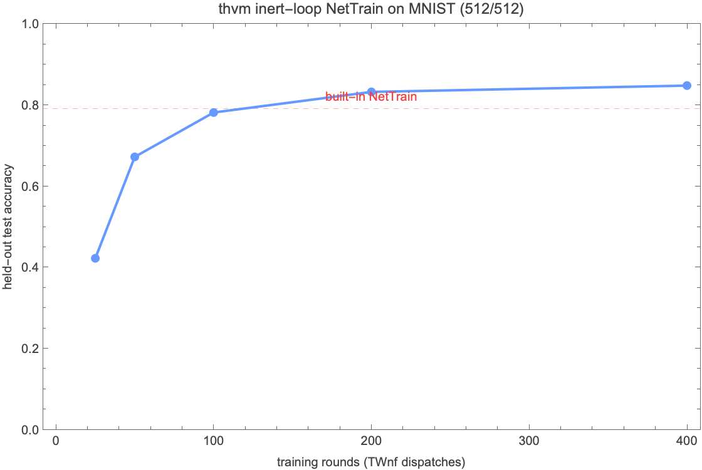

# Training a net as one interaction-net term: `NetTrain` on thvm

thvm can train a Wolfram net by emitting the **entire optimiser as a single
inert interaction-net term** and dispatching it with one `TWnf`. There is no
host-side `Do` loop: the whole training run is one normalisation.

```wolfram
net  = TFromNet[NetChain[{LinearLayer[64], ElementwiseLayer[Ramp], LinearLayer[10]},
                         "Input" -> 784]];
NetInitialize[net];                                       (* TNetInitialize, in place *)
data = RandomSample[ResourceData["MNIST", "TrainingData"], 1000];   (* no manual prep *)

(* the WHOLE optimiser as an inert term; TWnf is the only driver *)
trainNet = NetTrain[net, data, "TrainingNet", MaxTrainingRounds -> 400];
TWnf[trainNet];                                           (* fires every step in place *)

(* ...or the convenience form, which drives it and returns the trained forward *)
trained = NetTrain[net, data, MaxTrainingRounds -> 400];
preds   = TNetPredict[trained, testImages];
```

Following built-in `NetTrain`'s `prop` argument, `NetTrain[net, data,
"TrainingNet"]` returns the inert training-loop term -- nothing has run --
and `TWnf` dispatches it.  `NetTrain[net_TTerm, ...]` is installed as an
UpValue that delegates to `TNetTrain`; the built-in `NetTrain` symbol is left
untouched.  Data is a list of `input -> class` rules (or `"MNIST"`), and
inputs are reshaped to the net's input shape internally -- no host-side
`Flatten[ImageData[...]]` at the call site.  `NetInitialize[net_TTerm]`
re-initialises the weights in place (Glorot / ones / zeros) with no round-trip
through a Wolfram net.

## How the inert loop works

A single training step -- forward, categorical cross-entropy, the shared
backward, and one in-place SGD `ASSIGN` per weight -- is **materialised once**.
That step is then wrapped in a recursive lambda:

```
loop(k) = if k == 0 then 0 else <fire every weight's step>; loop(k - 1)
```

`TWnf @ loop(MaxTrainingRounds)` drives every iteration, re-firing the same
kernels while the weight buffers are mutated in place by the previous step's
`ASSIGN`. The optimiser literally *is* an interaction-net term -- the same
object the rest of thvm reduces.

Two runtime fixes make this work (both small, both regression-clean):

- **Per-iteration ASSIGN re-fire.** `assign_fire_claim`'s once-per-pass memo is
  keyed on an epoch that only `thvm_realize` advanced, so a `TWnf`-driven loop
  fired the step once regardless of `n`. Advancing the epoch on every `PRI`
  force (the loop's step boundary) makes each iteration its own pass.
  (`src/term/prims_core.c`)
- **Re-fireable step kernels.** In a multi-weight chain the first weight's
  forward/grad kernel was routed through the step worklist (`redex_fire`),
  whose `heap_replace` substituted the kernel away with its one-time output --
  baking the `ASSIGN`'s `src` slot to a stale constant. `heap_replace` now
  skips exactly the cell that is a `UOP_ASSIGN`'s `src` when the substituted
  term is a `UOP_KERNEL` (`cell_is_assign_src`), matching the wnf reducer,
  which resolves the src to a fresh TEN per pass without mutating the cell.
  Every other consumer (a one-shot `TRealize` root) is still substituted
  normally. (`src/wnf/redex.c`)

## Result vs built-in `NetTrain`

MNIST, 512 train / 512 held-out, same hidden architecture
(`LinearLayer[64] -> Ramp -> LinearLayer[10]`):



| trainer                                   | held-out test accuracy |
|-------------------------------------------|------------------------|
| thvm inert loop (400 rounds, SGD lr 0.05) | **0.85**               |
| built-in `NetTrain` (20 rounds, ADAM)     | 0.79                   |

The thvm curve is monotonic and crosses the built-in reference around 100
rounds; 400 full-batch rounds run in ~0.25 s. (The two regimes differ --
full-batch SGD vs mini-batch ADAM -- so this is a sanity comparison, not a
controlled benchmark; the point is that the inert-loop optimiser trains a real
net to a competitive accuracy.)

Reproduce: `wolframscript -file wl/THVMLink/Examples/nettrain_tutorial.wls`

## Inspecting a training run end to end

Because the optimiser is an ordinary thvm term, the whole introspection surface
(net structure, kernels, memory, codegen, profiling) applies to a training run
unchanged. This section walks a single run -- a `LinearLayer[64] -> Ramp ->
LinearLayer[10]` MLP on 256 MNIST images, 100 rounds -- through that surface
with real captured output.

Reproduce: `wolframscript -file wl/THVMLink/Examples/nettrain_introspection.wls`

### Net introspection

`TFromNet[net]` records the original Wolfram net and every trainable weight it
collects, keyed by the lifted term, so the net can be taken apart later.
`TNetParamInfo` returns each weight handle with the layer/role provenance used to
write trained weights back; `TNetParams` is the same handles without the
provenance; `TNetOf` returns the original `NetChain` the lift came from (so
`TNetTrain` can rebuild a fresh batched forward over its own input slot):

```
net = TFromNet[...]  ->  Head: TTerm
TNetParamInfo[net]  (4 trainable params, in layer order):
  param 1:  Layer=LinearLayer  Param=Weights  shape={784, 64}
  param 2:  Layer=LinearLayer  Param=Biases   shape={64}
  param 3:  Layer=LinearLayer  Param=Weights  shape={64, 10}
  param 4:  Layer=LinearLayer  Param=Biases   shape={10}
TNetParams[net]  ->  4 weight handles (TAG_TEN, TRequiresGrad)
TNetOf[net]  ->  NetChain[{LinearLayer, ElementwiseLayer, LinearLayer}]   (bit-faithful)
```

These four `TAG_TEN` handles, already flagged `TRequiresGrad`, are exactly what
`TGrad` differentiates against and what the inert loop's `ASSIGN`s mutate.

### Kernel, memory, and buffer stats

`NetTrain[net, data, "TrainingNet"]` is inert -- building it lifts the whole
optimiser into kernels and buffers, but nothing has run. The counts are
therefore identical before and after `TWnf`: the loop **re-fires the same 90
kernels in place** rather than allocating per round.

```
NetTrain[net, data, "TrainingNet"]  ->  Head: TTerm   (INERT: nothing has run)
-- before TWnf --                       -- after TWnf (100 rounds, 0.03 s) --
  TKernelCount   = 91                     TKernelCount   = 91
  TTensCount     = 352                    TTensCount     = 352
  TTotalBufBytes = 3559752 bytes          TTotalBufBytes = 3559752 bytes (live)

  TMemoryPlan: 90 kernels, 194 bufs, peak-concurrent-live = 1545160 bytes (total 2915912)
  TKernelOutputBytes: total 1695360 bytes across 90 kernels
  TProfileDelta: 90 kernels fired during the TWnf window
  top kernels by wallclock (this training window):
    kid 50  blas-gemm  fires=100  totalUs=3069.  GFLOP/s=837.1
    kid 26  blas-gemm  fires=100  totalUs=2989.  GFLOP/s=859.5
    kid  1  blas-gemm  fires=100  totalUs=2882.  GFLOP/s=891.4
    kid 75  blas-gemm  fires=100  totalUs=2797.  GFLOP/s=918.5
    kid 24  blas-gemm  fires=100  totalUs=1844.  GFLOP/s=1393.2
    kid 48  jit        fires=100  totalUs=1638.  GFLOP/s=2.0
```

`TProfileDelta[before, after]` subtracts two `TProfileAll[]` snapshots and keeps
only the kernels that fired in the window, with per-kernel dispatch counts,
wallclock, and GFLOP/s. Every kernel fired exactly 100 times -- once per round.
The dense matmuls dominate the wallclock and dispatch to a tuned CPU BLAS gemm
(`blas-gemm`); `TMemoryPlan` / `TKernelOutputBytes` / `TPoolStats` give the
aliasing-aware buffer plan, per-kernel output bytes, and worker-pool stats.

### Codegen: CPU (C99) and Metal (MSL)

Every kernel that is not BLAS-dispatched is rendered by thvm's own codegen, and
`TKernelSource[kid, backend]` returns that rendering for the `"C"` and `"Metal"`
backends -- pure codegen, no GPU dispatch, so both render on a CPU-only box. Here
is one representative codegen kernel across the two backends:

```c
// TKernelSource[kid, "C"]      C99, CPU
void k(void *out_v, const void *const *ins_v, unsigned n, const unsigned *in_numels) {
  (void)n; (void)in_numels;
  float *out = (float *)out_v;
  ...
```
```cpp
// TKernelSource[kid, "Metal"]  MSL
#include <metal_stdlib>
using namespace metal;
kernel void k(
    device float *out [[ buffer(0) ]],
    device const float *in0 [[ buffer(1) ]],
    device const float *in1 [[ buffer(2) ]], ...
```

On CPU the compiled artifact is a native dylib: hot kernels cross a fire-count
warmup gate and `clang -O3` compiles the rendered C into a JIT dylib under
`/tmp`, whose path `TKernelJitDylibPath[kid]` reports.

So one inert term lowers, through the same surface, to C99, Metal MSL, and native
machine code.

### Loss-trace callback firing on TWnf

The `PRI` mechanism lets a foreign WL callback fire **inside** the single
`TWnf`. Registering a callback on the loss makes the loss print live, once per
round, as the one normalisation runs -- there is still no host-side loop:

```
the inert loop fires N rounds under ONE TWnf; a TPri callback prints each round's loss live:

    [TWnf  round 001]   loss = 2.3249
    [TWnf  round 002]   loss = 2.2481
    [TWnf  round 003]   loss = 2.2163
    [TWnf  round 010]   loss = 2.0396
    [TWnf  round 020]   loss = 1.7932
    [TWnf  round 050]   loss = 1.1444
    [TWnf  round 080]   loss = 0.7588
    [TWnf  round 100]   loss = 0.6075

  100 callbacks fired DURING the single TWnf
```

The loop body forces a `TPri[callback, lossSlot, recurse]` after the weight
steps each round:

```wolfram
lossSlot = TDef[name<>"_loss", TMaterialize[TNf[loss]]];   (* loss as an in-graph buffer *)
lossCb   = Function[v, print["loss = ", First @ Normal @ TTensorData @ v]];
loop(k)  = if k == 0 then 0
           else <fire weight steps>; TPri[lossCb, lossSlot, loop(k - 1)]
```

The subtlety is **how** the callback reads the loss. The loss must be
materialised *in the graph* (`TMaterialize[TNf[loss]]`) so the value the `PRI`
forces is a ready buffer the callback reads directly with `TTensorData`. A
re-entrant host-side `TRealize` inside the callback during `TWnf` corrupts the
in-flight loop: with that, training silently diverges (final loss 7.9, accuracy
0) while the in-graph read trains cleanly (loss 2.32 -> 0.61, the same curve as a
callback-free run). Read the buffer; never re-enter the engine from the callback.

### Eval metrics and train profile

After the run, `TNetPredict` applies the trained forward (weights updated in
place) to held-out inputs, and the profile snapshots taken around the `TWnf`
give the train profile:

```
TNetPredict[net, testImages]  ->  held-out test accuracy (128 ex) = 0.766

train profile (the single TWnf):
  wall time          = 0.03 s for 100 rounds (0.3 ms/round)
  kernels fired      = 90
  total kernel us    = 30154.
  total dispatches   = 9000          (90 kernels x 100 rounds)
  aggregate GFLOP/s  = 435.7
```

## Convolutional nets

`TNetTrain` also trains a convolutional net directly from a Wolfram `NetChain`
(no `TFromNet` wrapper, no `TNetOf` round-trip):

```wolfram
trained = TNetTrain[NetModel["LeNet"], RandomSample[ResourceData["MNIST", "TrainingData"], 32],
                    MaxTrainingRounds -> 30, "LearningRate" -> 0.1];
preds   = TNetPredict[trained, testImages];
```

A trailing `SoftmaxLayer` is stripped so the loss trains on logits (the stable
`TCategoricalCrossEntropy`); `stripSoftmax` rebuilds each weight-bearing layer
into a fresh `NetChain`, which is also how it detaches the LeNet NetModel's
dangling output `NetDecoder` (`NetDrop` / `NetTake` / `NetReplacePart` all fail
on it). The batched conv forward (`{B, 1, 28, 28}` -> `{B, 10}`, matching the
per-example forward to ~1e-7) and the convolution weight-gradient (finite,
matching a central-difference numerical gradient to ~1e-4) both work, so the
whole pipeline -- batched forward, shared backward, inert SGD loop -- composes:
LeNet overfits a 32-image batch to accuracy 1.0.
- `NetTrain` returns the trained **forward term** (a term over a concrete input
  slot, weights updated in place); `TNetPredict` applies it to new inputs.
  `TApp[net, input]` on the no-input net LAM is now differentiable too (a
  separate fix in `interact_app_lam`), so training the input net's own weights
  is possible once the batched LAM forward lands.
